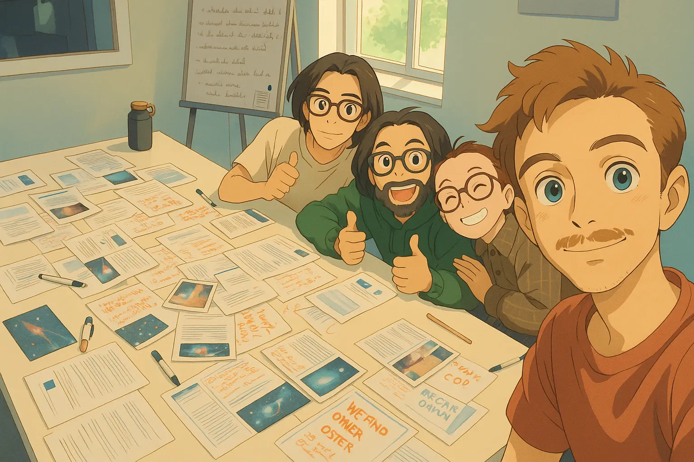
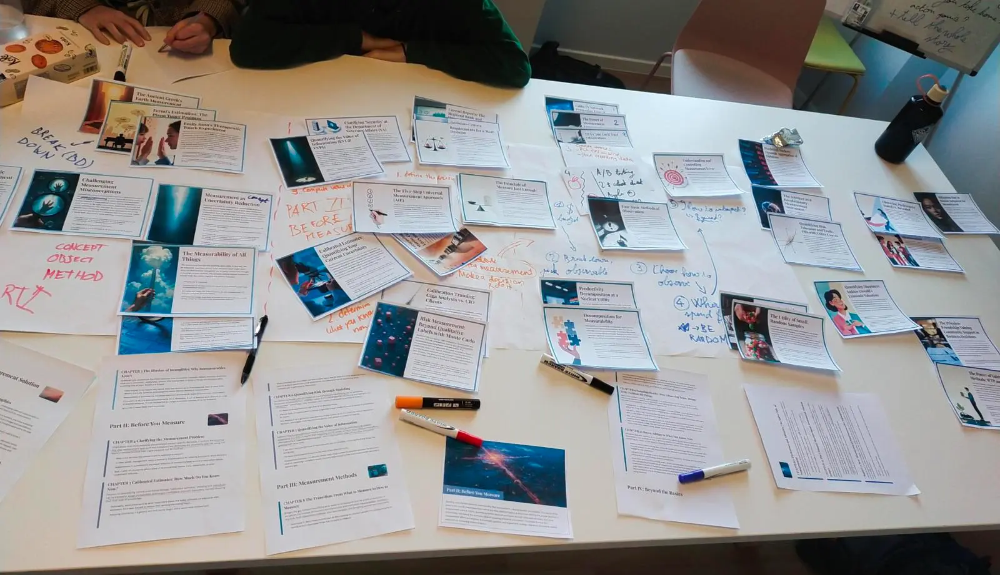

# Breaking Books

Turn any book into a collaborative, hands-on learning game.



## 🌍 A New Way to Read Together

Breaking Books is a system for turning non-fiction books into physical card games. It transforms the solitary act of reading into an active, shared experience.

It's more than a tool—it's a social practice. The goal is to create a space for people to learn actively, build shared understanding, and connect with each other, away from screens.

The project is inspired by *arpentage*, a 19th-century practice where French workers would physically break apart books. Each person would read a section and then meet to teach the others. In the same spirit, Breaking Books deconstructs a book so a group can rebuild its ideas together.

## 🎲 The Game: How It Works

The tool generates a single printable PDF containing the game materials:

1.  An **Enriched Table of Contents** with chapter summaries and key quotes, serving as your map for the journey.
2.  A deck of **Illustrated Cards**, each representing a core concept or a telling example from the book. The visuals help anchor the ideas, while quotes provide a direct line to the author's voice.


*[Image: A close-up shot of a few beautifully designed cards next to the enriched table of contents page.]*

### A Simple Guide to Your First Game

This is one way to play. Remember to adapt it and make it your own.

**1. 👋 Welcome & Setup (10-15 mins)**
-   Gather your group (3-5 people is ideal). Cover a large table with a sheet of paper to create your canvas.
-   Start with a welcome roundup: Why is everyone here? What's your interest in the book? What's your background on the topic?
-   Designate a timekeeper to help the game flow and protect time for discussion at the end.

**2. 🗺️ The Landscape (5 mins)**
-   Each player chooses a book section they will "guide."
-   Everyone takes 5 minutes to read the enriched Table of Contents for *their chosen section*. This gives each guide a bit more context.

**3. 🔄 Playing the Sections (The Core Loop)**
The game proceeds section by section. For each one:
-   The section's guide reads its "Section Card" aloud to introduce the theme.
-   Distribute all cards for that section among the players.
-   Players discuss and place their cards on the paper canvas, grouping them and drawing connections to make sense of the ideas.
-   At the end of the section, the guide tells the story of what you've built in **one minute sharp**.

**4. 🏆 The Grand Finale**
-   After the final section, the most courageous person tells the story of the *entire book* using the complete visual map.
-   Leave plenty of time for the open discussion that will follow!
-   Remember to take a picture of your beautiful creation! ✨

Success isn't winning; it's a great conversation and a new, shared perspective.

## 🚀 Get Your Own Game

### The Easy Way (Hosted App)

You can create your own game for free at **[breaking-books.therandom.space](https://breaking-books.therandom.space)**.

All you need is an EPUB file of a non-fiction book.

### For Developers (Running Locally)

<details>
<summary>Click to expand</summary>

### Setup and Dependencies
Requires [uv](https://docs.astral.sh/uv/getting-started/installation/) for package management.

To run the application locally, you will need API keys from Google (for Gemini) and Runware. Set them as environment variables:
```
export GOOGLE_API_KEY="your-google-api-key"
export RUNWARE_API_KEY="your-runware-api-key"
```

Then, install the dependencies:
```bash
uv sync
```

### Running the Web Application
```bash
uv run streamlit run src/simple_web.py
```

</details>

## 💡 The Project

This project was born during a hackathon, from a desire to explore new ways of interacting with books. Our next step is to play more games and gather feedback from people like you.

If you play a game, we would love to hear your story, feedback, or ideas. Please get in touch.

### Acknowledgements

- A special thank you to **Nia** and **Felix** for playtesting the very first game.
